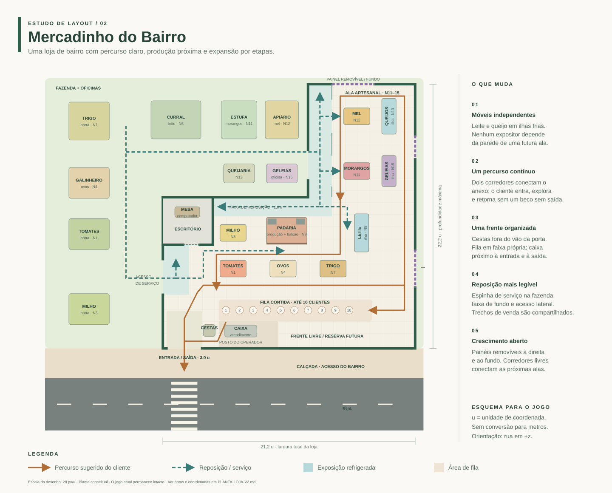
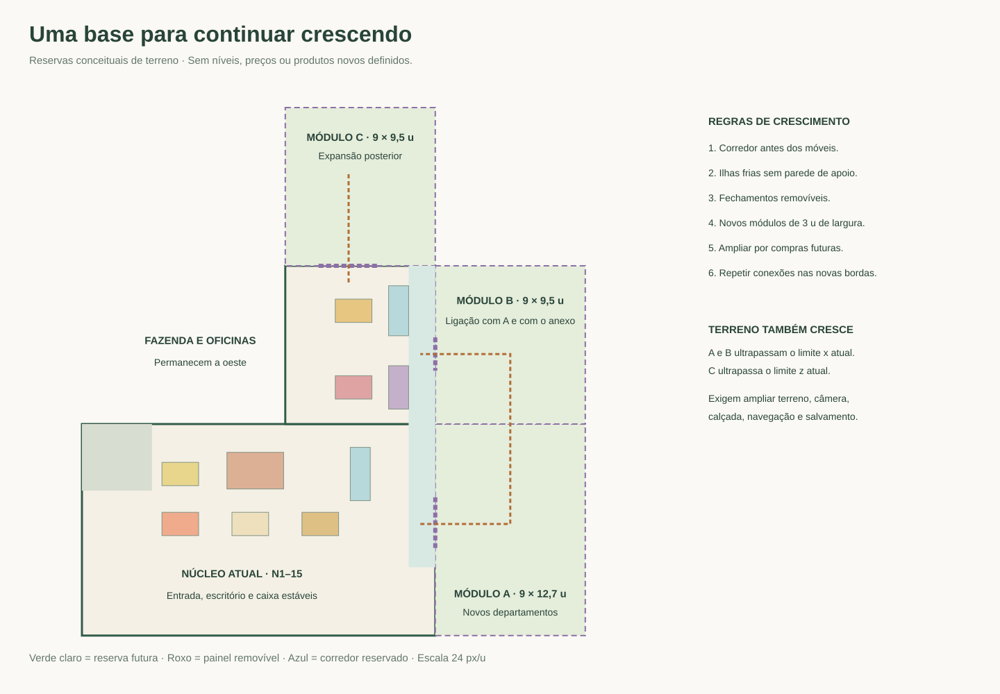

# Planta do Mercadinho do Bairro — mais espaço

A planta está implementada no jogo. A coleta, a entrega de ingredientes e a reposição continuam automáticas junto aos objetos, por qualquer lado acessível. Os círculos de interação foram removidos. A separação vem do espaço físico entre móveis e construções, com alcance de **0,9 u a partir da borda real** de cada estação.

O desenho usa coordenadas do jogo, sem equivalência com metros. [Etapas de expansão](PLANTA-LOJA-ETAPAS.svg) e [crescimento futuro](PLANTA-LOJA-CRESCIMENTO.svg) acompanham a mesma configuração.

Capturas: [loja inicial](previews/loja-n1.png), [leite no N5](previews/loja-n5.png), [loja no N15](previews/loja-n15.png), [celular](previews/loja-n15-mobile.png) e [escritório com paredes alinhadas](previews/escritorio.png).

## Organização e dimensões

O terreno aumentou para **40 × 37 u**, centrado em `(4; -4)`. A câmera e a navegação acompanham as novas bordas. A rua e a calçada foram prolongadas à direita.

A loja começa com **12,2 × 15 u**, apenas tomates e a infraestrutura inicial. O salão completo ocupa `x=-3,1…21,1`, `z=-8,3…6,7`, com **24,2 × 15 u**. O anexo artesanal ocupa `x=9,1…21,1`, `z=-19,5…-8,3`, com **12 × 11,2 u**. Área final aproximada: **363 + 134,4 = 497,4 u²**, pelas linhas centrais das paredes.

- Entrada, cestas e caixa conservam suas posições. O escritório compacto mede `4,2 × 3,5 u`, entre `z=-8,3` e `z=-4,8`, usando as paredes externas ao fundo e à esquerda. A porta e a divisória frontal ficam em `z=-4,8`, liberando `2,8 u` de profundidade para o salão. A mesa fica junto à parede do fundo (`z=-7,65`), a estante ocupa o canto esquerdo (`z=-7,25`) e a cadeira acompanha a mesa (`z=-6,55`), com acesso livre pela porta.
- Tomate e milho têm **2,2 u livres** entre bancas; tomate, ovos e trigo têm **2 u** entre as bordas da mesma fileira.
- A padaria fica mais ao fundo, separada das bancas da frente e da entrega de trigo.
- Leite e queijo continuam em **ilhas frias independentes das paredes**. O leite permanece no mesmo lugar do N5 em diante.
- Morango, mel, queijo e geleia ocupam um anexo mais largo e profundo. Há 3,1 u entre a borda das bancas centrais e a borda das ilhas laterais; o corredor externo tem 2,5 u até a linha da parede.
- Fazenda e oficinas foram afastadas entre si e da loja. Estufa e apiário ficam em `z=-17`; queijaria e cozinha em `z=-11,4`. O acesso de serviço do anexo fica em `x=9,1`, `z=-14…-10,7`.
- A fila mantém dez posições possíveis, de `(2,2; 3,5)` a `(12,55; 3,5)`, com 1,15 u entre centros, sem marcações no piso. Antes da compra de cestas extras, são cinco. Os números nas plantas indicam posições de espera apenas na documentação.

## Móveis implementados

| Produto | Centro x | Centro z | Largura × profundidade | Nível |
| --- | ---: | ---: | --- | ---: |
| Tomate | 2,8 | 0 | 2,2 × 1,4 | 1 |
| Milho | 2,8 | -3,6 | 2,2 × 1,4 | 3 |
| Ovos | 7 | 0 | 2,2 × 1,4 | 4 |
| Leite: ilha fria | 13,6 | -4,2 | 1,2 × 3,2 | 5 |
| Trigo | 11,2 | 0 | 2,2 × 1,4 | 7 |
| Padaria: balcão | 7,6 | -4,2 | 3,4 × 0,9 | 9 |
| Morango | 13,2 | -10,9 | 2,2 × 1,4 | 11 |
| Mel | 13,2 | -16 | 2,2 × 1,4 | 12 |
| Queijo: ilha fria | 18 | -16 | 1,2 × 3 | 13 |
| Geleia | 18 | -10,9 | 1,2 × 2,6 | 15 |

A entrega de trigo usa a caixa em `(6,2; -6,95)`, o moinho fica em `(6,45; -5,9)` e o forno em `(8,7; -5,9)`. Os padeiros acompanham essas posições nas animações.

## Crescimento por compra

Níveis, preços, requisitos e receitas seguem [DESBLOQUEIOS-POR-NIVEL.md](DESBLOQUEIOS-POR-NIVEL.md).

| Etapa | Piso | Conteúdo |
| --- | --- | --- |
| N1–2 | 12,2 × 15 u | Tomate; contratação do caixa no N2. |
| N3 | Mesmo piso | Milho e sua horta. |
| N4 | +3 × 15 u à direita | Ovos e galinheiro. |
| N5–6 | +3 × 15 u à direita | Leite e curral no N5; repositor no N6. |
| N7–10 | +6 × 15 u à direita | Trigo, cestas extras, padaria e cesta de trabalho. |
| N11–15 | +12 × 11,2 u ao fundo | Morango, mel, queijo e geleia conforme suas compras; melhorias no N14. |

Pisos e equipamentos futuros permanecem ocultos até a compra correspondente. A ala artesanal abre a ligação posterior de todas as extensões e o acesso lateral de serviço. A construção mantém as áreas anteriores alcançáveis.

## Próximos departamentos

| Reserva | Área futura | Painel removível |
| --- | --- | --- |
| A: continuação lateral do salão | `x=21,1…30,1`, `z=-8,3…6,7` | `x=21,1`, `z=-1,6…1,6` |
| B: continuação dos artesanais | `x=21,1…30,1`, `z=-19,5…-8,3` | `x=21,1`, `z=-15,2…-13,2` |
| C: continuação ao fundo | `x=9,1…21,1`, `z=-30,7…-19,5` | `z=-19,5`, `x=11,1…14,7` |

Os painéis continuam fechados e com colisão, usando o mesmo acabamento das paredes. O perímetro baixo da fachada, lateral direita e anexo tem altura uniforme de 0,75 u, com tampo e rodapé verdes contínuos. As reservas não adicionam compras ou produtos ao jogo atual. Quando novos departamentos forem definidos, ampliar novamente terreno, limites, câmera, rua/calçada, navegação e migração dos salvamentos. Cada ampliação deve prolongar os corredores e reservar a conexão seguinte antes de colocar móveis.

## Interação e validação

O alcance considera o retângulo real da estação, sem exigir um ponto no piso. Paredes ou móveis entre o jogador e o objeto impedem a transferência. Inventário misto abastece somente a banca visitada; oficinas recebem apenas os ingredientes da receita. A escolha atua em uma estação por intervalo.

Os **19 envelopes de coleta e reposição** têm separação superior a duas vezes o raio de interação; portanto, produtos diferentes não compartilham alcance. O teste também verifica todos os lados acessíveis dos objetos, corredor entre estufa e oficina, separação do escritório e acesso ao salão recuperado, e preservação de dinheiro, compras, ingredientes e cargas na migração.

Regenerar as plantas com `node scripts/render-floor-plan.mjs`. Verificar ida e volta de todos os pontos de coleta, reposição e compra nos níveis 1, 3, 4, 5, 7, 9, 11, 12, 13 e 15 com `node scripts/check-store-layout.mjs`. Rodar `npm test` e `npm run build` para conferir circulação com dez clientes, produção, repositor, animações e salvamentos.

Validação concluída: **139 testes passam**, assim como a compilação e as rotas de ida e volta em todos os níveis verificados. As capturas cobrem N1, N5 e N15 no desktop e N15 em celular, sem exceções JavaScript.

O renderizador alternativo utiliza os mesmos modelos e posições. As capturas de desktop e celular são verificações em navegador; toque em aparelho físico ainda não foi medido.
