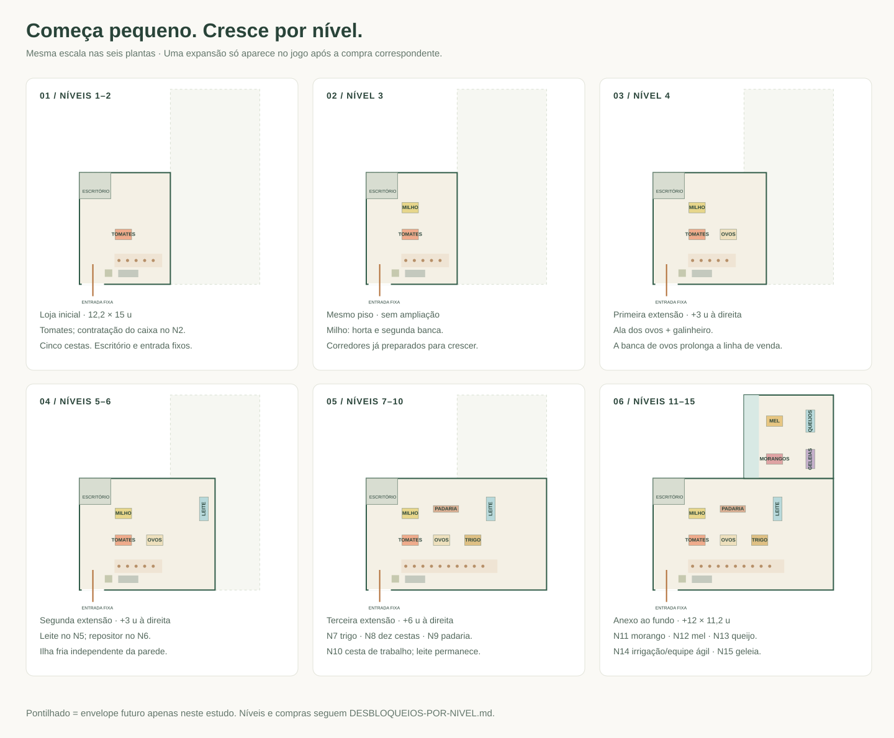

# Nova planta do Mercadinho do Bairro

[Abrir o plano de crescimento futuro](PLANTA-LOJA-CRESCIMENTO.svg). O nível 15 representa o conteúdo disponível hoje. A planta reserva conexões à direita e ao fundo para acrescentar departamentos depois, com expositores independentes das paredes externas e fechamentos removíveis.

[Abrir as plantas por etapa](PLANTA-LOJA-ETAPAS.svg). A loja começa com **12,2 × 12,7 u** e apenas tomates. Milho acrescenta uma banca sem ampliar o piso. Ovos, leite e trigo acrescentam três extensões laterais sucessivas; a padaria usa o salão existente; os artesanais acrescentam o anexo posterior. Escritório, entrada e caixa têm posições estáveis desde o início.

[Abrir a planta vetorial](PLANTA-LOJA-V2.svg). O desenho usa as coordenadas do jogo: **28 pixels por unidade**, `x` cresce para a direita e `z` cresce em direção à rua. As dimensões são unidades do cenário, sem equivalência assumida com metros. Esta entrega é uma proposta de layout; a cena e a simulação ainda usam a planta atual.

## Avaliação da loja atual

A imagem mostra uma identidade consistente: madeira nas bancas, piso claro, detalhes verdes e produção agrícola visível. O escritório compacto e as paredes baixas ajudam a entender as atividades dos personagens na câmera isométrica.

As bancas estão dispersas pelo salão, sem alinhamento suficiente para formar corredores fáceis de ler. O leite e os produtos artesanais ficam em regiões distintas; o anexo ao fundo depende da passagem pela ala dos ovos. A padaria ocupa a frente, onde compete visualmente com o caixa. Há bastante piso livre, mas ele ainda não organiza uma sequência clara de entrada, escolha, espera e saída.

O código acrescenta um problema específico: a fila cresce horizontalmente a partir de `CONFIG.clienteCaixa`, com espaçamento de 1,15 u. Dez clientes ocupam 10,35 u entre o primeiro e o último centro, cruzando a frente de outras atividades. Uma mudança de posição precisa reservar essa extensão inteira.

## Organização proposta

Preservar a silhueta em L e o terreno existente durante os desbloqueios atuais. O salão principal vai de `x=-3,1` a `18,1` e de `z=-6` a `6,7`; o anexo vai de `x=9,1` a `18,1` e de `z=-15,5` a `-6`. Isso representa aproximadamente **269,2 u² + 85,5 u² = 354,7 u²**, medidos pelas linhas centrais das paredes. O salão inicial continua com 12,2 × 12,7 u, e as três extensões laterais continuam com 3 u cada. Essas bordas podem avançar em compras futuras.

- **Entrada:** manter o vão frontal de 3 u, em `x=-2,8…0,2`. Reservar espaço de chegada antes da primeira banca. Cestas ficam à direita, fora da linha direta da porta. A saída usa o mesmo vão.
- **Hortifruti:** alinhar tomate e milho no lado esquerdo do salão. Usar bancas de 2,2 × 1,4 u, com um corredor transversal de 1,6 u entre elas. Ovos e trigo prolongam a mesma linha de exposição.
- **Padaria:** transferir a produção e o balcão para a parte posterior do salão inicial. Abastecer trigo pelo lado de fundo e vender pão pelo lado do salão. A padaria fica visível no percurso sem ocupar a fachada.
- **Laticínios:** usar um refrigerador de leite como ilha independente, com acabamento em todas as faces e infraestrutura própria. Ele fica em `(13,6; -3)` desde o nível 5. Queijo usa outra ilha fria no anexo. Ambos permanecem no lugar quando a parede externa avança. Refrigerar o queijo é uma proposta visual; não há nova regra de conservação nesta entrega.
- **Artesanais:** morango e mel em duas ilhas alinhadas; queijo e geleia em módulos independentes, afastados da parede direita. Usar dois corredores longitudinais conectados nas extremidades para formar um percurso de ida e retorno. A faixa de `x=16,5…18,1` permanece livre, com 1,6 u entre móveis e linha da parede.
- **Caixa:** manter atendimento na frente esquerda do salão, com uma faixa de espera paralela à fachada. A faixa tem 12,9 × 1,8 u, suficiente para dez posições a 1,15 u de distância. Os números na planta são posições de espera, não novos caixas.
- **Serviço:** manter a entrada lateral da fazenda, organizar uma faixa posterior de 1,6 u e uma passagem de 2 u na borda oeste do anexo. Criar um acesso lateral às oficinas em `x=9,1`, `z=-10…-7,4`. A reposição das ilhas e dos refrigeradores compartilha trechos do salão com os clientes; as setas azuis mostram esses cruzamentos.

As setas de clientes indicam um percurso possível e acesso ao final da fila. Cada pedido pode usar um trajeto menor: não obrigar o cliente a percorrer toda a loja.

## Coordenadas propostas para implementação

Os valores abaixo são os centros e dimensões dos **novos móveis**. Não substituir somente `prateleira`: atualizar também os pontos de compra e reposição, colisões e geometria de cada modelo.

| Produto / móvel | Centro x | Centro z | Largura × profundidade | Nível |
| --- | ---: | ---: | --- | ---: |
| Tomate | 2,8 | 0 | 2,2 × 1,4 | 1 |
| Milho | 2,8 | -3 | 2,2 × 1,4 | 3 |
| Ovos | 7 | 0 | 2,2 × 1,4 | 4 |
| Leite: ilha fria | 13,6 | -3 | 1,2 × 3,2 | 5 |
| Trigo | 11,2 | 0 | 2,2 × 1,4 | 7 |
| Padaria: produção e balcão | 7,3 | -3,2 | 3,4 × 2,2 | 9 |
| Morango | 13,2 | -8,2 | 2,2 × 1,4 | 11 |
| Mel | 13,2 | -12,8 | 2,2 × 1,4 | 12 |
| Queijo: ilha fria | 15,9 | -12,8 | 1,2 × 3 | 13 |
| Geleia: módulo independente | 15,9 | -8,2 | 1,2 × 2,6 | 15 |
| Caixa: balcão | 3,45 | 5,25 | 2,7 × 1 | 1 |
| Cestas | 0,8 | 5,2 | 1 × 1 | 1 |

Primeira posição da fila: `(2,2; 3,5)`. Última: `(12,55; 3,5)`. O corredor de compra ao sul das bancas passa em `z=1,4`, separado da faixa de fila, que começa em `z=2,6`. O corredor transversal posterior passa em `z=-1,2`. No anexo, os centros dos corredores de clientes são `x=11,8` e `x=17,2`. O intervalo de 1 u entre as ilhas centrais e os módulos de queijo/geleia serve como separação; o percurso principal e as futuras conexões passam pelo corredor externo.

O centro do corredor oeste do anexo fica a 0,7 u da linha da divisória em `x=11,1`. O código usa margem de 0,27 u na colisão do jogador; os clientes exigem validação própria. Na implementação, evitar rodapés salientes nessa borda e ajustar a largura à geometria final dos personagens. Todas as larguras são intenções de projeto, sujeitas à validação da navegação do jogo.

## Expansão sem perder o começo do jogo

O desenho mostra a loja completa do nível 15. Preservar níveis, custos e requisitos de [DESBLOQUEIOS-POR-NIVEL.md](DESBLOQUEIOS-POR-NIVEL.md). Antes de comprar uma expansão, manter o seu piso e móveis ocultos.

| Etapa | Piso disponível | Alteração no layout |
| --- | --- | --- |
| N1–2 | Salão original: 12,2 × 12,7 u | Tomate, escritório, cestas e um caixa; contratação no N2. Reservar cinco posições de fila. |
| N3 | Mesmo salão | Adicionar milho; sem crescimento físico. |
| N4 | Salão + primeira faixa de 3 u | Construir a ala dos ovos e o galinheiro, após compra. |
| N5–6 | Salão + duas faixas de 3 u | Adicionar curral e ilha fria estável na ala do leite. Contratar repositor no N6. |
| N7–10 | Salão + três faixas de 3 u | Adicionar trigo no N7 mantendo o leite na mesma posição; dez cestas no N8; padaria no N9; cesta de trabalho no N10. |
| N11–15 | Piso anterior + anexo de 9 × 9,5 u | Estufa e morango no N11, mel no N12, queijo no N13, melhorias no N14 e geleia no N15. |

Cada compra revela somente o conteúdo correspondente. A planta da última etapa reúne todos os desbloqueios para comparar o tamanho final, mas o nível 11 ainda não mostra mel, queijo ou geleia. Irrigação e reposição ágil no nível 14 não alteram o piso.

A ilha fria de leite cabe na ala do nível 5, com centro `(13,6; -3)` e envelope de 1,2 × 3,2 u. Sua face de atendimento pode ficar voltada para oeste. Ela permanece nessa posição durante a expansão do nível 7 e as seguintes. No nível 5 há 0,9 u até a linha da parede direita; essa faixa se amplia para 3,9 u no nível 7. O corredor externo de crescimento fica inteiramente disponível após a terceira extensão. Não exigir a compra de trigo para vender leite.

Ovos aparecem na área já acessível após a expansão do nível 4; sua nova banca fica no salão original, enquanto a ampliação lateral acrescenta circulação. Ao comprar a ala artesanal no nível 11, abrir sua ligação com o salão e o acesso de serviço às oficinas. Manter áreas desbloqueadas alcançáveis durante a construção.

## Crescimento depois dos desbloqueios atuais

Organizar a expansão em módulos cuja largura seja múltipla de 3 u. Os módulos de 9 u desenhados são reservas de projeto: podem ser construídos de uma vez ou divididos em três compras. Novos níveis, produtos, preços e requisitos serão definidos quando o conteúdo existir; [DESBLOQUEIOS-POR-NIVEL.md](DESBLOQUEIOS-POR-NIVEL.md) mantém os desbloqueios atuais.

| Reserva | Área futura | Conexão com a loja |
| --- | --- | --- |
| A: continuação lateral do salão | `x=18,1…27,1`, `z=-6…6,7` | Painel removível em `x=18,1`, `z=-1,6…1,6`, alinhado a uma faixa livre entre leite e trigo. |
| B: continuação lateral dos artesanais | `x=18,1…27,1`, `z=-15,5…-6` | Painel removível em `x=18,1`, `z=-11,2…-9,2`, entre queijo e geleia, acessível pelo corredor externo. Conectar também a A quando ambos existirem. |
| C: continuação ao fundo | `x=9,1…18,1`, `z=-25…-15,5` | Painel removível em `z=-15,5`, `x=11,1…14,7`, ligado ao corredor transversal atrás das ilhas. |

Os painéis continuam fechados e com colisão enquanto não houver uma ala comprada do outro lado. Ao construir, remover apenas os trechos de fechamento necessários e criar o novo perímetro externo. A planta completa marca esses painéis em roxo. Não colocar estoque, refrigeradores, balcões ou equipamentos de produção nos acessos reservados.

Em cada nova ala, continuar o corredor principal e reservar a próxima ligação antes de distribuir os móveis. A ligação entre A e B cria um percurso de retorno após ambas as compras. Até lá, cada módulo precisa de corredores internos e espaço de retorno; o jogador deve poder entrar e sair pelo mesmo acesso. Uma extensão de C deve repetir a reserva de passagem ao fundo. Manter a fazenda e suas oficinas a oeste, onde já têm acesso de serviço.

A expansão exige mais terreno: o mundo atual termina em `x=17,5` e `z=-16`, e a borda visual do terreno fica em `x=19` e `z=-17,5`. A/B e C ultrapassam esses limites. A implementação futura deve ampliar `limiteMundo`, `limiteCamera`, piso do terreno, rua/calçada quando crescer lateralmente, navegação, enquadramento e migração de salvamentos. Dimensionar as novas bordas depois de definir móveis e acessos; a planta não pressupõe que esse terreno já esteja disponível no jogo.

Leite e queijo precisam de modelos próprios de ilha, com traseira acabada; retirar um modelo de refrigerador de parede e deixá-lo solto não conclui essa mudança. Representar sua alimentação e equipamentos dentro do próprio módulo ou pelo piso, sem vínculos visuais com paredes que serão removidas.

## Direção de interiores

Manter verde profundo nos rodapés e fachadas, creme no piso e madeira clara nas bancas. Usar a mesma orientação e altura para todas as ilhas de hortifruti. Diferenciar refrigeradores com vidro e azul suave, e a padaria com madeira mais quente. Pequenas placas por departamento podem orientar sem competir com os produtos.

Manter paredes de frente e direita baixas para a câmera isométrica. O escritório permanece no canto atual e conserva a porta de correr. Uma borda contínua de piso pode marcar a fila; evitar barreiras altas que escondam clientes ou bloqueiem a passagem do jogador.

## Validação da proposta

O gerador da planta verifica que os dez envelopes de produtos cabem nos respectivos pisos e não se sobrepõem; também verifica o corredor de 1,6 u entre tomate e milho, a faixa externa de 1,6 u junto a queijo/geleia e o encaixe dos produtos em cada uma das seis etapas. O leite usa a mesma posição desde o nível 5. Regenerar as três plantas com `node scripts/render-floor-plan.mjs`.

A circulação desenhada é conceitual. Antes de aplicar ao jogo, validar os pontos de interação com o raio de 0,9 u, os volumes reais dos modelos e a margem de colisão de cada ator. Verificar entrada, compras de todos os produtos, fila cheia, saída, reposição, acesso ao computador e cada estágio de expansão. A proposta também requer atualizar as rotas da padaria, renderização alternativa e migração de posições de personagens salvos. Testar a leitura da cena em desktop e celular na câmera isométrica atual.
